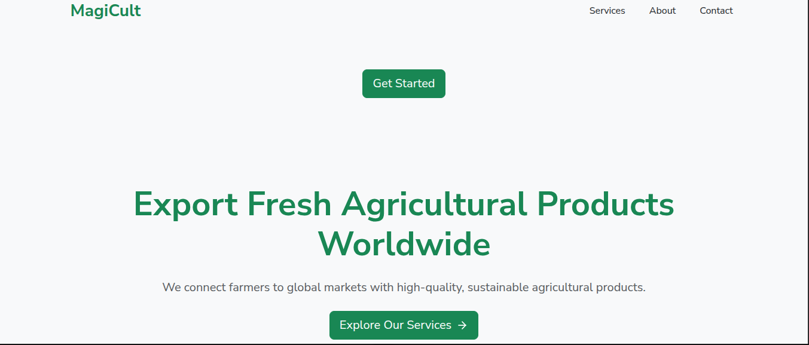
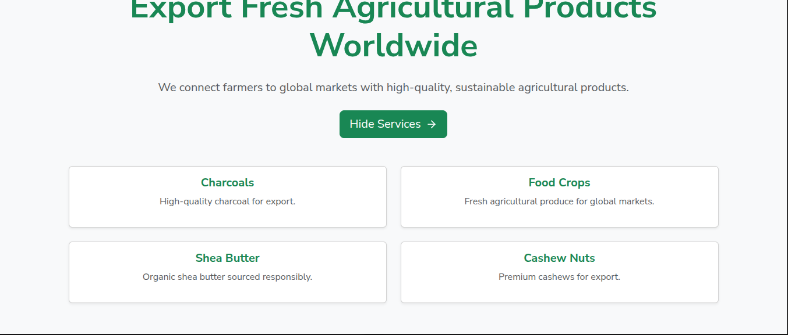
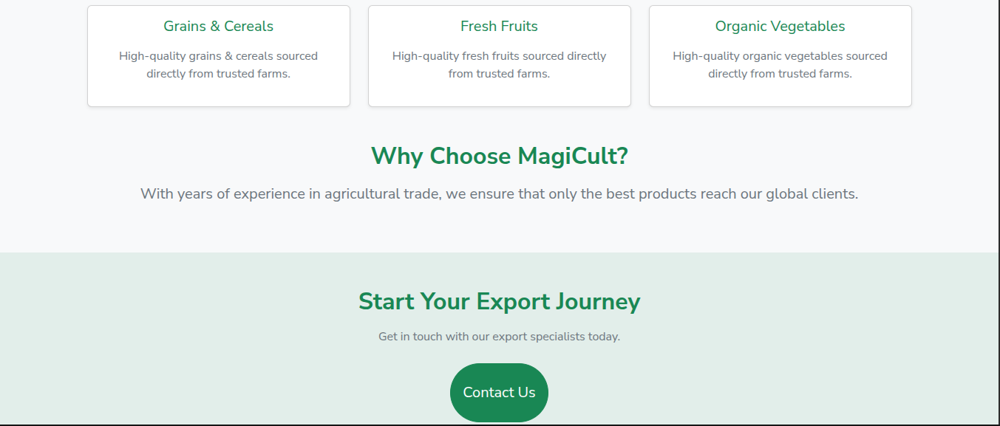
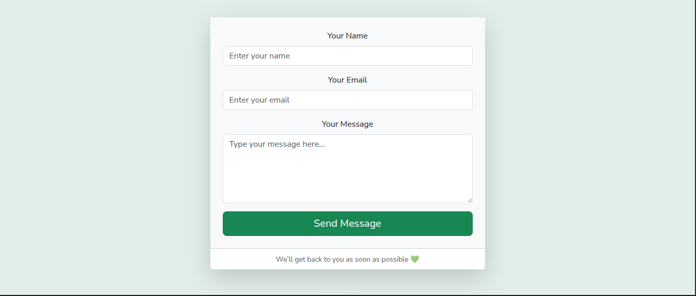

#   🌍 Magicult

Magicult is a modern export partnership platform that connects businesses with global buyers. With a focus on African exports like charcoal, food crops, and spices, Magicult simplifies the onboarding process, provides clear guidance, and empowers partners to scale their export business efficiently.

##   ✨ Features

📝 Getting Started Guide – step-by-step process to become a partner.

📦 Export Categories – Charcoal, Food Crops, Spices, and more.

🌍 International Buyer Connections – access to verified buyers across the globe.

📊 Dashboard Insights – track your products, orders, and partner growth.

🔔 Notifications – real-time updates for approvals and transactions.

📩 Contact Form – simple and responsive way to reach our team.

##   🛠 Tech Stack

###   Frontend:
```
React + TypeScript

React Bootstrap (UI components & modals)

Formik + Yup (forms & validation)
```
###   Backend:
```
Ruby on Rails (API-only)

PostgreSQL (database)

Devise + JWT (authentication)

ActiveStorage (file uploads)

ActionCable (real-time notifications)

Payments & Integration:

Stripe API (secure payments)
```
##   🚀 Getting Started
###    Prerequisites

Make sure you have installed:
```
Node.js (>= 18)

React (19.1.1)

Ruby (>= 3.2)

Rails (>= 7)

PostgreSQL
```
###  Clone the repo
```
git clone https://github.com/your-username/magicult.git
cd magicult
```

###   Backend Setup
```
cd backend
bundle install
rails db:create db:migrate
rails server
```

###   Frontend Setup
```
cd frontend
npm install
npm start
```

```
  Frontend runs on http://localhost:3000
  backend runs on http://localhost:3001
```

##   📸 Screenshots





Get Started Modal

##    🤝 Contributing

We welcome contributions!

### Fork the repo

`Create a feature branch (git checkout -b feature-name)`

`Commit changes (git commit -m "Add feature")`

`Push to branch (git push origin feature-name)`

### Open a Pull Request

##   📜 License

This project is licensed under the MIT License.

##   📧 Contact

For questions, partnerships, or support:
📩 Email: support@magicult.com

🌍 Website: www.magicult.com

⚡ Magicult – Export made simple, partnerships made powerful.
